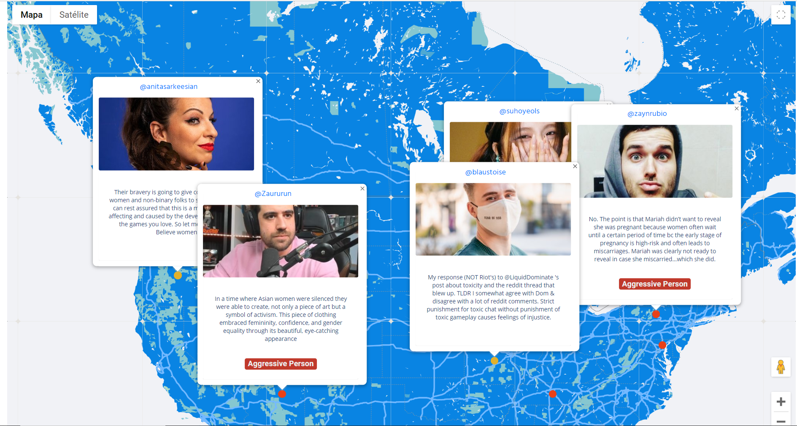

# ShellHacks
Hate Map for Shell Hacks



**Inspiration**  
We suffer harassment all the time and anyone attacks you when you give your opinion, the people who know the attacker to discredit the things you share and apparently everyone is against you, however there are only two or three people who have a lot of weight in social networks.

**What it does**  
First we extract all tweets with tweepy, then we pass it to azure content moderator to determine the intent of the tweet, if the content is strong and hateful we analyze the profile of the person with ibm personality insight and the natural processing of ibm, we use cloudant, flask and NLP, once we did this we placed it on a map to track the impact their tweets have on other people.

**Project Technologies**  
For this project we use:

* Twitter Stream Data in Raw (Bc we don't have access to the Deloper Twitter API's, our applicattions was rejected)
* Python = ```['Pandas', 'Anaconda', 'Jupyter Notebooks', 'stat', 'Flask', 'Tweepy']```
* Azure = ```['Cognitive Services','Text Analysis', 'Content Moderator', 'Azure Notebooks']```
* Google = ```['Maps', 'Firebase', 'Collab']```
* GitHub 
* IBM = ```['IBM Watson', 'Watson NLP', 'Cloudant', 'Personality Insights']```
* Web = ```['HTML', 'CSS', 'JS', 'Node Js']```

**How we built it**  
We did not have access to the twitter api because the accounts we created blocked them, then we obtained from [here the data](https://archive.org/search.php?query=collection%3Atwitterstream&sort=-publicdate&page=2) that corresponds to the raw tweets to be able to analyze them, then put them on a hate map.

**Structure Project**

* [Azure Notebooks](https://github.com/FernandaOchoa/ShellHacks/tree/master/TwitterAzureContentModerator): Here we collect all twitter data, processing and moderate the "Tweet" text, where we looking for any insight abot hate speech or harassement, if found somenthing automatically send it to Firebase (Disclaimer: It's in disorder xD our Notebook).

* [IBM Personality Insights](https://github.com/FernandaOchoa/ShellHacks/tree/master/TwitterPersonalityInsightsIBMBackend): Once we detect a "tweet" negative, we get the twitter handle and pass over to a Personality Insights Analysis, to consist in (With a borrowed twitter dev account) extract all the information from the twitter handle and analyse with Text Analytics and Natural Language Processing, to get a more trust data and can send it to Personality Insights and get the personality of this account and verify if it's a casuality or it's a violent person. Then we send it to Firebase node and set the information in our DB. Also we've create a Cloudant DB to analyze more accounts and get a behavior of a trending topic but it's work in progress... we got an accoun until today by the 5am...

* [Google Tech](https://github.com/FernandaOchoa/ShellHacks/tree/master/TwitterMapFirebaseGoogleMaps): When the data it's on Firebase RT, we consume REST API our DB and put it on a Custom Marker Map, with the Moderated (Azure) tweet, and also with a tag to announce if the account is or not **agressive** this information it comes from IBM Analysis.

**Accomplishments that we're proud of**  
We managed to participate in our first hackathon in the United States and we obtained a project that challenges us even though we were afraid of the participation of the great universities in the United States, we learned to use the technologies that are in the project, we built an api and called it On the web, and learning Artificial Intelligence and how to use the maps and implement them, the most important thing is that we did the project and inadvertently used several technology providers, which was what we knew and applied and it looked easier and github, and our team have two members
